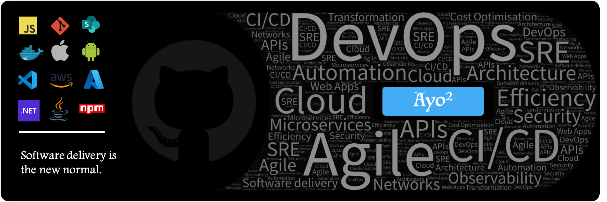
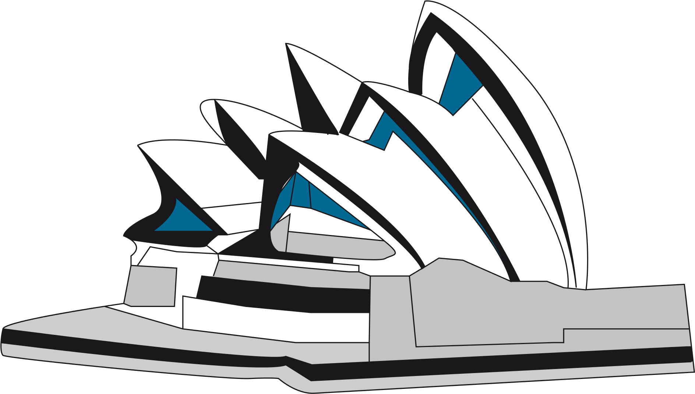

### 👋 Hello, I'm Ayodeji (double joy), but you can call me Ayò.

I am a Senior Customer Success Architect at [GitHub](https://www.github.com), working out of Sydney, Australia . With a strong background in DevOps and software delivery, I am passionate about helping organizations enhance their development workflows and achieve their goals.

- 🔭 **Current Role:** Helping GitHub customers get the best out of GitHub by providing expert guidance and support.
- 🌱 **Learning:** Currently diving deep into GraphQL to expand my technical skillset.
- 👯 **Collaboration:** Interested in collaborating on DevOps academic and technical research topics to push the boundaries of what we can achieve in the field.
- 💬 **Expertise:** Feel free to ask me about DevOps, software delivery, and organizational performance. I am always eager to share my knowledge and insights.
- 📫 **Contact:** The best way to reach me is through a direct message on .
- 😄 **Pronouns:** He/Him.
- ⚡ **Fun Fact:** I have a distinctive and funny 😆 laugh that always brings joy to those around me!

I am committed to continuous learning and professional growth, and I enjoy working with teams to solve complex challenges and drive innovation. Let's connect and explore how we can collaborate and make a difference together!
